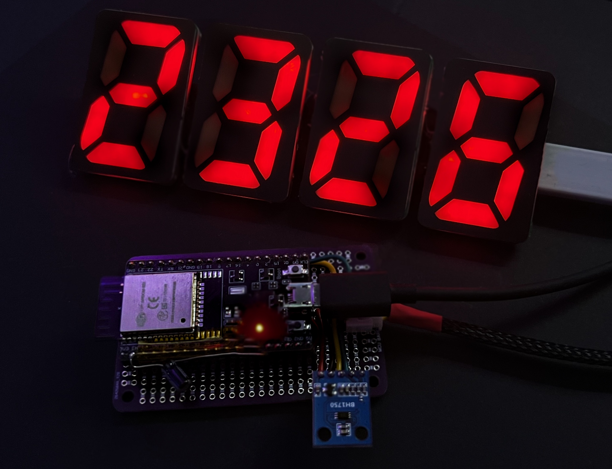

# Mini Clock RGB - ESPHome 7-Segment Clock

ESPHome includes support for addressable LED lights, as well as LED matrices. But what if you want to make a 7-segment clock using RGB LEDs?

This example project implements a 4-digit, 7-segment style clock using an ESP32 microcontroller, an WS2812B addressable LED strip, and ESPHome. It integrates with Home Assistant for configuration and color control. 

All you need is to customize the YAML file to get started. It contains the settings and logic to drive a DIY clock, using ESPHome and c++ code in lambdas.

The reference hardware used are custom made PCBs with WS2812 LEDs in series, but of course regular strips could be used to form the digits as well.



## Project Components

1. In the `src/` directory is a [standalone firmware](src/main.cpp) that can connect to wifi and maintain color and light levels. It does not support OTA or connect to home assistant, it's fairly simple.
2. In the `esphome/` folder is a [self-contained YAML configuration](esphome/rgb-clock.yaml) that can be used with Home Assistant and ESPHome. 
3. In `homeassistant/` is an example [automation](homeassistant/clock_automation.yaml) and [script](homeassistant/calculate_clock_color_script.yaml) that will change the color of the clock throughout the day by storing an Hue/Saturation value in a text helper.


## What It Does

*   Displays colorful time in HH:MM format using 4x 7-segment digits.
*   Uses a BH1750 ambient light sensor with smoothing filter for automatic brightness adjustment.
*   Configurable day maximum brightness and night target brightness via Home Assistant `number` entities.
*   Configurable lux threshold for switching between day and night modes via a Home Assistant `number` entity.
*   Manual enable/disable of automatic night mode dimming via a Home Assistant `switch`.
*   Manual color selection via a Home Assistant RGB light entity (`light.clock_color`).
*   The HA light's brightness slider acts as a master brightness scale factor, applied on top of the ambient calculation (primarily affecting day mode, night mode uses its own target).
*   Turning the HA light entity ON/OFF triggers a configurable fade-in/fade-out effect for the clock display.
*   Digital dimming technique for very low brightness levels (1-3) when night mode is active.
*   Reports the final calculated brightness (0-255) via a `sensor` entity.
*   Reports whether night mode logic is currently active via a `binary_sensor` entity.

## Hardware Requirements

*   ESP32 Development Board
*   WS2812B Addressable LED Strip (configured for 84 LEDs, 3 per segment)
*   BH1750 Ambient Light Sensor
*   Appropriate power supply for ESP32 and LED strip
*   Wiring (connecting sensor via I2C, LED strip data pin)

## Software Requirements

*   [ESPHome](https://esphome.io/)
*   [Home Assistant](https://www.home-assistant.io/) (for full functionality)

## Setup Instructions

1.  **Clone Repository:**
    ```bash
    git clone <repository-url>
    cd mini-clock-rgb
    ```

2.  **Configure Secrets:**
    *   Navigate to the `esphome` directory.
    *   Rename `secrets-example.yaml` to `secrets.yaml`.
    *   Edit `secrets.yaml` and fill in your specific Wi-Fi credentials, Home Assistant API key, desired OTA password, and timezone. See comments in the file for details.

3.  **(Optional) Adjust Pin Configuration:**
    *   Open `esphome/rgb-clock.yaml`.
    *   Review the `substitutions:` section near the bottom.
    *   Change `led_pin`, `i2c_sda_pin`, `i2c_scl_pin`, and `bh1750_address` to match your specific hardware setup if different from the defaults.
    *   Adjust `leds_per_segment` if your clock uses a different number of LEDs for each segment line (default is 3).
    *   **IMPORTANT:** If you change `leds_per_segment`, you **must** manually recalculate and update `num_leds` accordingly. The formula is `num_leds = 4 * 7 * leds_per_segment` (4 digits, 7 segments per digit).

4.  **Compile and Upload:**
    *   Using the ESPHome tool (command line or HA Add-on/Dashboard):
        ```bash
        esphome run esphome/rgb-clock.yaml
        ```
    *   Follow the prompts to compile and upload the firmware to your ESP32 via USB for the first time. Subsequent updates can use OTA.

5.  **Integrate with Home Assistant:**
    *   Once the device connects to your network, Home Assistant should automatically discover it.
    *   Alternatively, go to Settings -> Devices & Services -> Add Integration and search for ESPHome. Enter the device name (`mini-clock-rgb` unless changed) or IP address.

## Home Assistant Configuration

Once integrated, the clock exposes the following entities in Home Assistant:

*   **Light (`light.clock_color`):**
    *   Controls the base color of the clock digits.
    *   Turning this entity ON/OFF triggers a fade-in/fade-out sequence for the clock display.
    *   The brightness slider sets a scaling factor (0.0-1.0) that is multiplied with the ambient-light-derived brightness, primarily affecting day mode brightness. Setting it low will dim the clock even during the day. (Night mode uses its own target brightness).
*   **Switch (`switch.night_mode_enabled`):**
    *   Turn ON to allow the clock to automatically switch to the `night_target_brightness` when ambient light drops below `lux_night_threshold`.
    *   Turn OFF to force the clock to always use the day mode logic (ambient scaled by HA brightness slider).
*   **Number (`number.day_max_brightness`):**
    *   Sets the maximum brightness level (1-255) the clock will reach during the day when ambient light is high and the HA brightness slider is at 100%.
*   **Number (`number.night_target_brightness`):**
    *   Sets the target brightness level (1-255) used when night mode is active (requires `switch.night_mode_enabled` to be ON and lux below threshold). Low values (1-3) activate digital dimming.
*   **Number (`number.lux_night_threshold`):**
    *   Sets the ambient light level (in lux) below which night mode *can* activate (if the `switch.night_mode_enabled` is ON).
*   **Sensor (`sensor.ambient_light`):**
    *   Displays the current reading from the BH1750 sensor (after filtering).
*   **Sensor (`sensor.clock_actual_brightness`):**
    *   Displays the final calculated brightness level (0-255) being applied to the LEDs after considering ambient light, HA brightness scale, night mode, and fades.
*   **Binary Sensor (`binary_sensor.clock_night_mode_active`):**
    *   Indicates `ON` if night mode dimming is currently active (i.e., switch is enabled AND ambient is below threshold AND calculated ambient brightness is below night target), `OFF` otherwise.

## Notes

*   Make sure `secrets.yaml` is **not** committed to public repositories.
*   The final display brightness depends on a combination of the ambient light sensor reading, the Day/Night configuration numbers, the Night Mode switch state, and the brightness level set on the `light.clock_color` entity in HA.
*   Toggling the `light.clock_color` entity OFF/ON in HA initiates a fade sequence.
