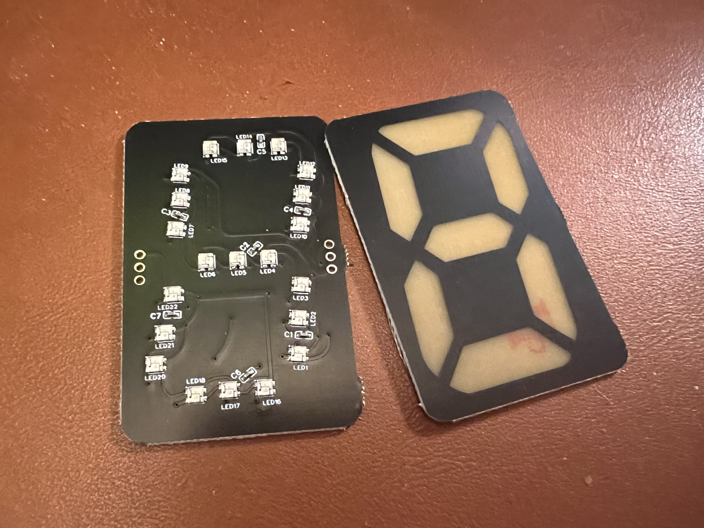
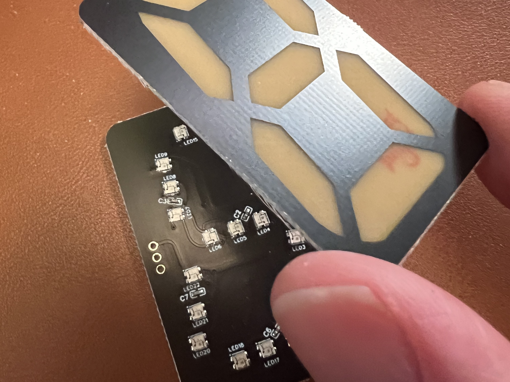
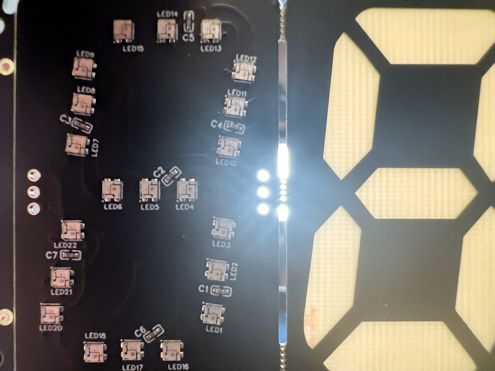
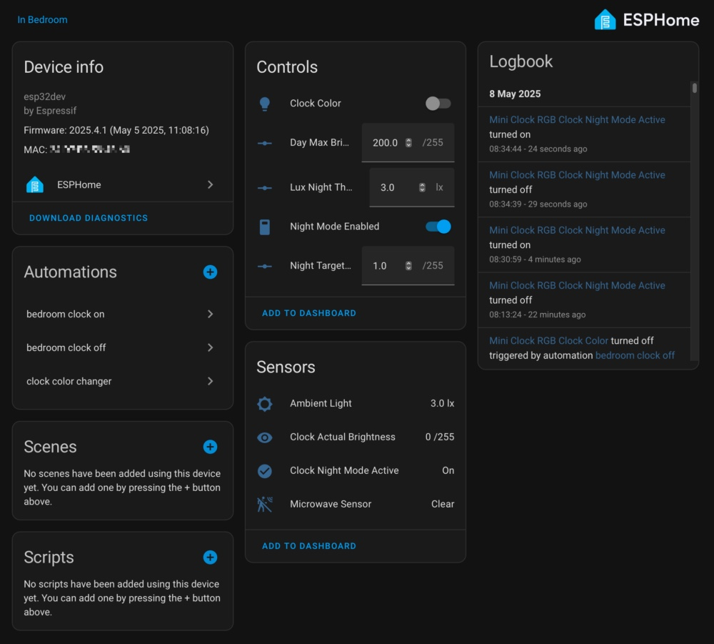

# Mini Clock RGB - 7-Segment RGB Clock Projects


This repository contains **two separate implementations** of a 4-digit, 7-segment style clock using an ESP32 microcontroller and WS2812B addressable LED strips.

The reference hardware uses custom PCBs with WS2812 LEDs in series, but regular LED strips can be used to form the digits as well.



## Project Options

Choose the implementation that best fits your needs:

### 1. 🚀 **Standalone PlatformIO Firmware** (Recommended for beginners)
- **Location:** [`src/main.cpp`](src/main.cpp)
- **Platform:** PlatformIO with Arduino framework
- **Features:** Basic WiFi clock with automatic failover to random number mode
- **Dependencies:** No Home Assistant required
- **Setup:** Simple WiFiManager configuration via captive portal

### 2. 🏠 **ESPHome + Home Assistant Integration** (Advanced features)
- **Location:** [`esphome/rgb-clock.yaml`](esphome/rgb-clock.yaml)
- **Platform:** ESPHome
- **Features:** Full Home Assistant integration with advanced color/brightness controls
- **Dependencies:** Requires Home Assistant and ESPHome
- **Setup:** YAML configuration with OTA updates

---

## Hardware Requirements

**Required Components:**
- ESP32 Development Board (tested: ESP32 DevKit, Seeed XIAO ESP32S3)
- WS2812B Addressable LED Strip (84 LEDs total: 4 digits × 7 segments × 3 LEDs per segment)
- 5V Power Supply (adequate for ESP32 and LED strip)
- Jumper wires for connections

**Optional Components:**
- BH1750 Ambient Light Sensor (I2C) - for automatic brightness adjustment

**Wiring:**
- LED Strip Data Pin → ESP32 GPIO 5 (configurable in platformio.ini)
- LED Strip 5V → Power Supply 5V
- LED Strip GND → Power Supply GND and ESP32 GND
- ESP32 VIN → Power Supply 5V (if using 5V supply)
- BH1750 SDA → ESP32 GPIO 21 (if using light sensor)
- BH1750 SCL → ESP32 GPIO 22 (if using light sensor)
- BH1750 VCC → ESP32 3.3V
- BH1750 GND → ESP32 GND

---

# 🚀 Option 1: Standalone PlatformIO Firmware

## What This Firmware Does

The standalone firmware provides a simple, reliable clock implementation:

**Core Features:**
- **WiFi Time Sync:** Connects to WiFi and syncs time via NTP
- **Automatic Failover:** If WiFi fails, displays random colorful numbers (0000-9999)
- **Colorful Display:** Each digit shows in different colors with smooth animations
- **Easy Setup:** Uses WiFiManager for simple WiFi configuration via captive portal
- **Auto-Reconnect:** Attempts to reconnect to WiFi every 60 seconds when in random mode
- **Visual Feedback:** LED animations during time sync and connection attempts

**Optional Features (compile-time enabled):**
- **BH1750 Light Sensor:** Automatic brightness adjustment based on ambient light
- **Night Mode:** Automatic dimming in low light conditions

## Setup Instructions

### 1. Install PlatformIO
- Install [PlatformIO IDE](https://platformio.org/platformio-ide) or [PlatformIO Core](https://platformio.org/install/cli)

### 2. Clone and Build
```bash
git clone <repository-url>
cd mini-clock-rgb
pio run -t upload
```

### 3. WiFi Configuration
1. After flashing, the ESP32 will create a WiFi access point named **"Mini Clock RGB"**
2. Connect to this AP with your phone/computer
3. A captive portal will open automatically (or go to 192.168.4.1)
4. Select your WiFi network and enter the password
5. The clock will connect and start displaying time

### 4. Optional: Enable Light Sensor
To enable the BH1750 light sensor support:

**Method A:** Edit `src/main.cpp` and change:
```cpp
#define BH1750_ENABLED 0
```
to:
```cpp
#define BH1750_ENABLED 1
```

**Method B:** Add to `platformio.ini` build flags:
```ini
build_flags = -D BH1750_ENABLED=1
```

### 5. Supported Boards
The firmware is tested on:
- **ESP32 DevKit V1** (default)
- **Seeed XIAO ESP32S3**

To switch boards, use:
```bash
pio run -e seeed_xiao_esp32s3 -t upload
```

## Troubleshooting

**Clock shows random numbers instead of time:**
- WiFi connection failed or was lost
- Check WiFi credentials via the captive portal
- Wait for automatic reconnection (attempts every 60 seconds)

**No display at all:**
- Check power supply (5V with adequate current)
- Verify LED strip data pin connection (default: GPIO 5)
- Check LED strip ground connection

**Dim display:**
- If using BH1750 sensor, check sensor wiring
- Sensor may be reading low light levels

For even cooler clocks with Home Assistant integration, check out [SolidDifference](https://soliddifference.com) and the [open source clock firmware](https://github.com/soliddifference/siebenuhr_core) it is based on. (disclaimer: I'm part of that collective &#9786;)

---

# 🏠 Option 2: ESPHome + Home Assistant Integration



## What This Implementation Does

The ESPHome version provides advanced features through Home Assistant integration:

**Advanced Features:**
- **Full HA Integration:** Native Home Assistant device with multiple entities
- **Advanced Color Control:** RGB color picker with HSV support
- **Intelligent Brightness:** BH1750 sensor with smoothing filter for automatic adjustment
- **Day/Night Modes:** Configurable brightness thresholds and targets
- **Manual Override:** Switch to disable automatic brightness adjustment
- **Fade Effects:** Smooth fade-in/fade-out when toggling the display
- **Digital Dimming:** Ultra-low brightness levels (1-3) for night use
- **Real-time Monitoring:** Live brightness and night mode status reporting
- **OTA Updates:** Over-the-air firmware updates via Home Assistant
- **Home Assistant Automations:** Color changes throughout the day via included scripts

## Software Requirements

- [ESPHome](https://esphome.io/) (Add-on or standalone)
- [Home Assistant](https://www.home-assistant.io/) with ESPHome integration

## Setup Instructions

### 1. Clone Repository
```bash
git clone <repository-url>
cd mini-clock-rgb
```

### 2. Configure Secrets
- Navigate to the `esphome` directory
- Rename `secrets-example.yaml` to `secrets.yaml`
- Edit `secrets.yaml` with your specific settings:
  - WiFi credentials
  - Home Assistant API key
  - OTA password
  - Timezone (see comments in file)

### 3. (Optional) Hardware Configuration
Open `esphome/rgb-clock.yaml` and review the `substitutions:` section:
- `led_pin`: LED strip data pin (default: GPIO 5)
- `i2c_sda_pin`: I2C SDA pin for BH1750 (default: GPIO 21)
- `i2c_scl_pin`: I2C SCL pin for BH1750 (default: GPIO 22)
- `bh1750_address`: I2C address of BH1750 sensor (default: 0x23)
- `leds_per_segment`: LEDs per segment line (default: 3)

**⚠️ Important:** If changing `leds_per_segment`, update `num_leds` using: `num_leds = 4 × 7 × leds_per_segment`

### 4. Compile and Upload
Using ESPHome (command line or HA Add-on):
```bash
esphome run esphome/rgb-clock.yaml
```
- First upload requires USB connection
- Subsequent updates use OTA

### 5. Home Assistant Integration
- Home Assistant should auto-discover the device
- Manual integration: Settings → Devices & Services → Add Integration → ESPHome
- Enter device name (`mini-clock-rgb`) or IP address

## Home Assistant Entities

Once integrated, the clock exposes these entities:

**🎨 Light Control:**
- **`light.clock_color`** - RGB color picker and master brightness control
  - Color selection for clock digits
  - ON/OFF triggers fade-in/fade-out effects
  - Brightness slider scales ambient-adjusted brightness

**🌙 Brightness Management:**
- **`switch.night_mode_enabled`** - Enable/disable automatic night mode
- **`number.day_max_brightness`** - Maximum brightness (1-255) for day mode
- **`number.night_target_brightness`** - Target brightness (1-255) for night mode
- **`number.lux_night_threshold`** - Ambient light threshold (lux) for night mode

**📊 Monitoring:**
- **`sensor.ambient_light`** - Current BH1750 sensor reading (filtered)
- **`sensor.clock_actual_brightness`** - Final calculated LED brightness (0-255)
- **`binary_sensor.clock_night_mode_active`** - Night mode status indicator

## Home Assistant Automations

The repository includes example automations in the `homeassistant/` directory:

- **`clock_automation.yaml`** - Changes clock color throughout the day
- **`calculate_clock_color_script.yaml`** - Script for color calculations based on time

To use these:
1. Copy the files to your Home Assistant configuration directory
2. Create a text helper entity for storing HSV values
3. Restart Home Assistant to load the automations

## Important Notes

- **Security:** Never commit `secrets.yaml` to public repositories
- **Brightness Logic:** Final brightness combines ambient sensor, HA brightness slider, and day/night settings
- **Digital Dimming:** Very low brightness values (1-3) use special digital dimming for ultra-dim display
- **Fade Effects:** Toggling the light entity ON/OFF triggers smooth transitions

---

## Support & Community

For even cooler clocks with Home Assistant integration, check out [SolidDifference](https://soliddifference.com) and the [open source clock firmware](https://github.com/soliddifference/siebenuhr_core) it is based on. (disclaimer: I'm part of that collective &#9786;)

## License & Contributing

This project is open source. Feel free to contribute improvements, bug fixes, or additional features via pull requests.
